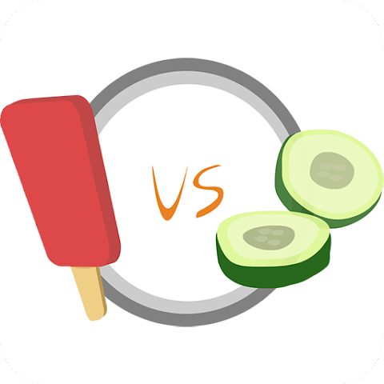
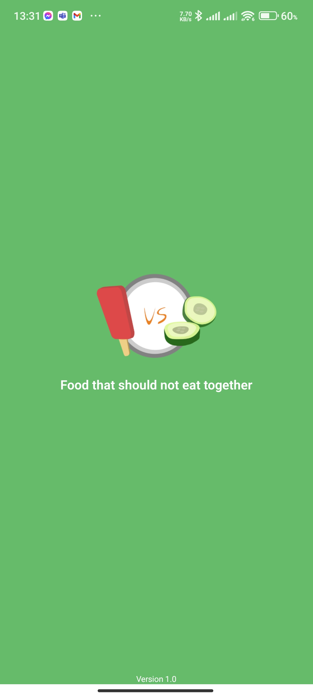
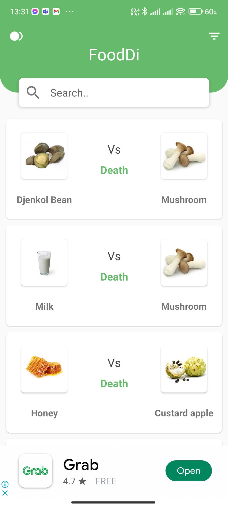
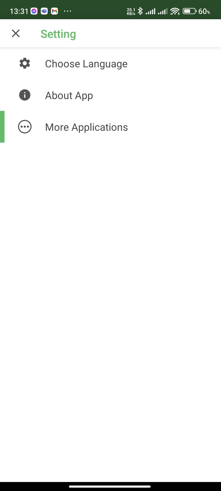

# FoodDi

FoodDi is the first ever app of my life in Android Development. And also I've used kotlin in this app for first time. Later, I updated it with firebase store and local cache to offline mode.

## Tech stack
- MotionLayout (Constraint)
- Room Database
- Retrofit
- Firebase

## Screenshots

<table>
  <tr>
    <td style="padding: 20px">  </td>
  </tr>
  <tr>
    <td style="padding: 4px"> </td>
  </tr>
  <tr>
    <td style="padding: 20px">  </td>
    <td style="padding: 20px">  </td>
    <td style="padding: 20px">  </td>
  </tr>
</table>

