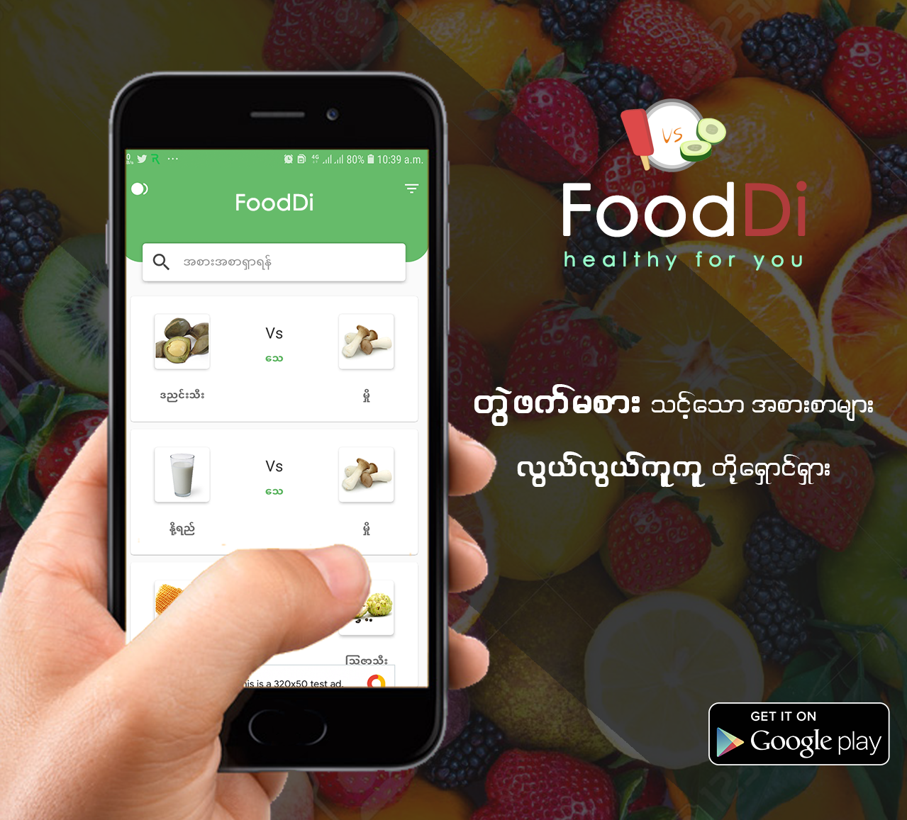

# FoodDi

Food Di is the first ever App of my life in Android Development. And also I've used Kotlin Language in this app for first time. Later, I updated it with firebase store for image storage and local database(Room) for offline mode.

*Jetpack compose is developing and stable now to use in production apps. So, I decide to revamp it with Jetpack compose and released on July 27, 2024, and then remove all xml layouts and activity logic.*

## Tech stacks

- Kotlin 2.0.0
- Jetpack Compose
    - Compiler 2.0.0
    - Strong skipping enabled
- KSP (Kotlin Symbol Processing)
- Dagger-Hilt

## Libraries and third parties
- Accompanist-permissions
- SplashScreen API
- Preference DataStore
- Room Database
- Firebase
- Coil 
- Timber

## Features Screenshots

<table>
  <tr>
    <td style="padding: 20px">  </td>
    <td style="padding: 20px">  </td>
    <td style="padding: 20px">  </td>
  </tr>
  <tr>
   <td style="padding: 20px">  </td>
    <td style="padding: 20px">  </td>
    <td style="padding: 20px">  </td>
  </tr>
</table>

